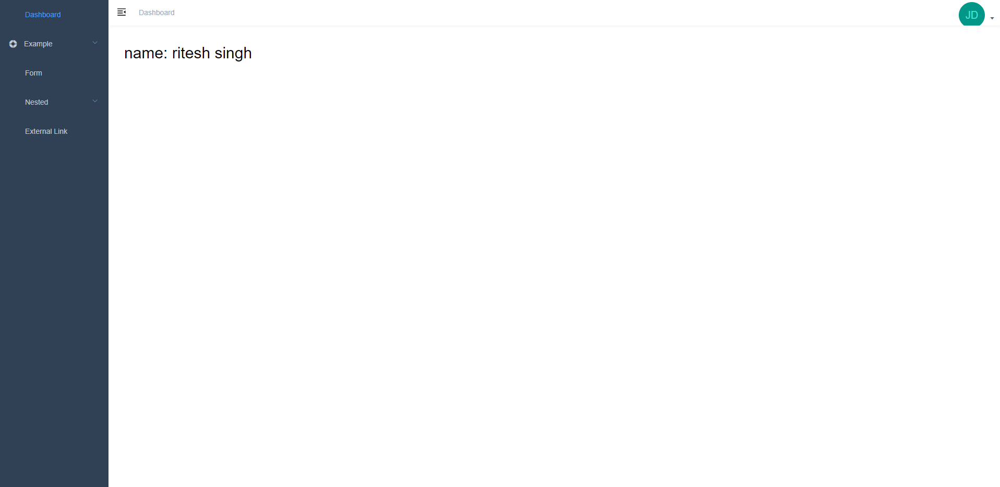

# Laravel Vue - SPA Starter Template


Laravel Vue Starter template is a perfect place for laravel and vue spa starter projects.
Based on [Vue.js](https://github.com/vuejs/vue) and the UI Toolkit [Element](https://github.com/ElemeFE/element). The work is inspired by  [vue-element-admin](http://panjiachen.github.io/vue-element-admin) with our love on top of that. With the powerful Laravel framework as the backend, Vue.js as the high performance on the frontend,  Laravue appears to be a full-stack solution for an enterprise application level.


### Features
- Laravel Framework Version 7
- Spatie [Media library](https://github.com/spatie/laravel-medialibrary) for user logo and image
- registration and login process with email verification
- Roles and Permissions Using Spatie [Laravel Permission](https://github.com/spatie/laravel-permission)
- Maintain Activity log of users
- Minimal Admin Panel With No Clutter

## Prerequisites
``` 
sudo apt install jpegoptim optipng pngquant gifsicle
npm install -g svgo
```

### Installing

```bash
# Clone the project and run composer
composer create-project riteshsingh1/laravel-vue-spa

# Migration and DB seeder (after changing your DB settings in .env)
php artisan migrate --seed

# Install dependency with NPM or Yarn
npm install # or yarn

# develop
npm run dev # or npm run watch

# Build on production
npm run production
```
## Screenshot
<p align="center">
  
</p>

## Acknowledgements

* [vue-element-admin](https://panjiachen.github.io/vue-element-admin/#/) A magical vue admin.
* [Media library](https://github.com/spatie/laravel-medialibrary) Laravel Media Library
* Spatie [Laravel Permission](https://github.com/spatie/laravel-permission)
